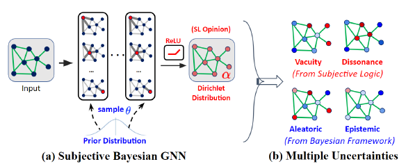

# Uncertainty-GNN

This is a TensorFlow implementation of the uncertainty-GNN model as described in our paper:
 
[Xujiang Zhao](https://zxj32.github.io/), Feng Chen, Shu Hu, Jin-Hee Cho. [[Uncertainty Aware Semi-Supervised Learning on Graph Data]](https://zxj32.github.io/data/NIPS2020_Uncertainty.pdf), NeurIPS 2020 (**Spotlight**) [Slides](https://zxj32.github.io/data/NIPS2020-Uncertainty_slides.pdf)    [Poster](https://zxj32.github.io/data/NIPS2020-poster.pdf)




A multi-source uncertainty framework of GNN that reflecting various types of uncertainties in both deep learning and belief/evidence theory domains for node classification predictions.


## Installation

1. Clone this repository.
   ```sh
   git clone https://github.com/zxj32/uncertainty-GNN
   cd uncertainty-GNN
   ```

2. Install the following dependencies. The code should run with TensorFlow 1.0 and newer.
* TensorFlow (1.0 or later)
* python 3.6.9
* networkx
* scikit-learn
* scipy
* numpy
* pickle

## Run the demo

After set up above 2 steps, you are ready to run our code. You can directly run a demo code:
```bash
python S-GCN.py
```

For our proposed *S-BGNN-T-K* model, you need to run following code. For example, to get prior Dirichlet Distribution (save in "data/prior/"), please try to run:
```bash
python Kernel_Graph.py
```
to get pretrain Teacher network (save in "data/output/" or "data/ood/"), please try to run:
```bash
python Baseline.py -dataset cora --model GCN --OOD_detection 1
```

to run our method (*S-BGNN-T-K*) (--OOD_detection: 1 means OOD detection task, 0 means Misclassification task):
```bash
python S-BGCN-T-K.py -dataset cora --OOD_detection 1
```    
If there is no error display, then we are done for this section.

(Notice: Our code is based on original GCN code: https://github.com/tkipf/gcn)

## Dataset

In order to use your own data, you have to provide 
* an N by N adjacency matrix (N is the number of nodes), and
* an N by D feature matrix (D is the number of features per node)
* an N by E binary label matrix (E is the number of classes).

Have a look at the `load_data()` function in `input_data.py` for an example.

Our paper used six datasets, including 
* citation network datasets

> Cora, Citeseer, and Pubmed datasets, the original datasets can be found here: http://www.cs.umd.edu/~sen/lbc-proj/LBC.html.

* Coauthor Physics, Amazon Computer, and Amazon Photo

> Provided by https://github.com/shchur/gnn-benchmark (Oleksandr Shchur, Maximilian Mumme, Aleksandar Bojchevski, Stephan Günnemann, [Pitfalls of Graph Neural Network Evaluation](https://arxiv.org/abs/1811.05868), Relational Representation Learning Workshop, NeurIPS 2018).  


## Models

You can choose between the following models: 
>Our proposed:
* `S-GCN`: Subjective GCN that can estimate two evidential uncertainty types (vacuity and dissonance).
* `S-BGCN`: Subjective GCN with the Bayesian framework that can estimate all four uncertainty types, including aleatoric uncertainty, epistemic uncertainty, vacuity and dissonance.
* `S-BGCN-T`: S-BGCN with a Teacher network to improve the expected class probability estimation.
* `S-BGCN-T-K`: S-BGNN-T with Graph kernel Dirichlet Distribution Estimation (GKDE) to improve the uncertainty (Dirichlet distribution) estimation.

>basline:
* `GCN`: Softmax-based GCN with uncertainty measured based on entropy (Thomas N. Kipf, Max Welling, [Semi-Supervised Classification with Graph Convolutional Networks](http://arxiv.org/abs/1609.02907), ICLR 2017)
* `Drop-GCN`: adapts the Monte-Carlo Dropout into the GCN model to learn probabilistic uncertainty (Y. Gal and Z. Ghahramani, [Dropout as a bayesian approximation: Representing model uncertainty in deep learning](https://arxiv.org/abs/1506.02142), ICML 2016)
* `EDL-GCN`: adapts the EDL model with GCN to estimate evidential uncertainty (Murat Sensoy, Lance Kaplan, Melih Kandemir, [Evidential Deep Learning to Quantify Classification Uncertainty](https://arxiv.org/abs/1806.01768), NeurIPS 2018)
* `DPN-GCN`: adapts the DPN [14] method with GCN to estimate probabilistic uncertainty (Andrey Malinin, Mark Gales, [Predictive Uncertainty Estimation via Prior Networks](https://arxiv.org/abs/1802.10501), NeurIPS 2018)

## Question

If you have any question, please feel free to contact me. Email is good for me. 

## Cite

Please cite our paper if you use this code in your own work:

```
@article{zhao2020uncertainty,
  title={Uncertainty Aware Semi-Supervised Learning on Graph Data},
  author={Zhao, Xujiang and Chen, Feng and Hu, Shu and Cho, Jin-Hee},
  journal={Advances in Neural Information Processing Systems},
  volume={33},
  year={2020}
}
```

